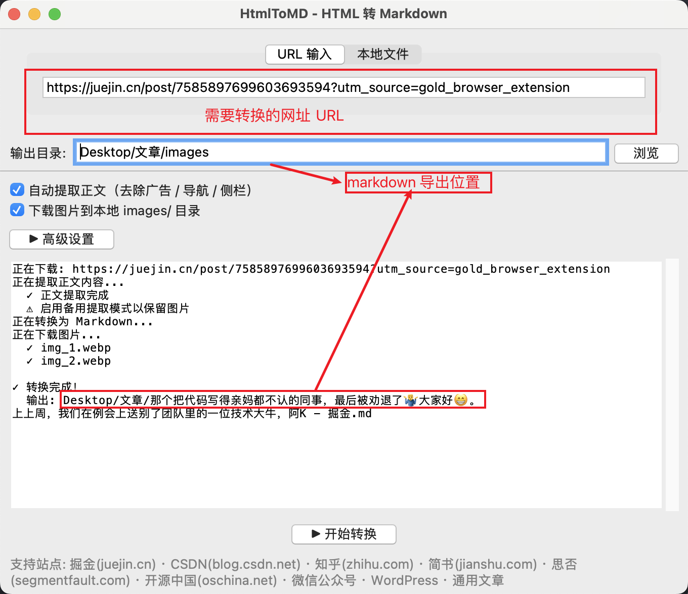
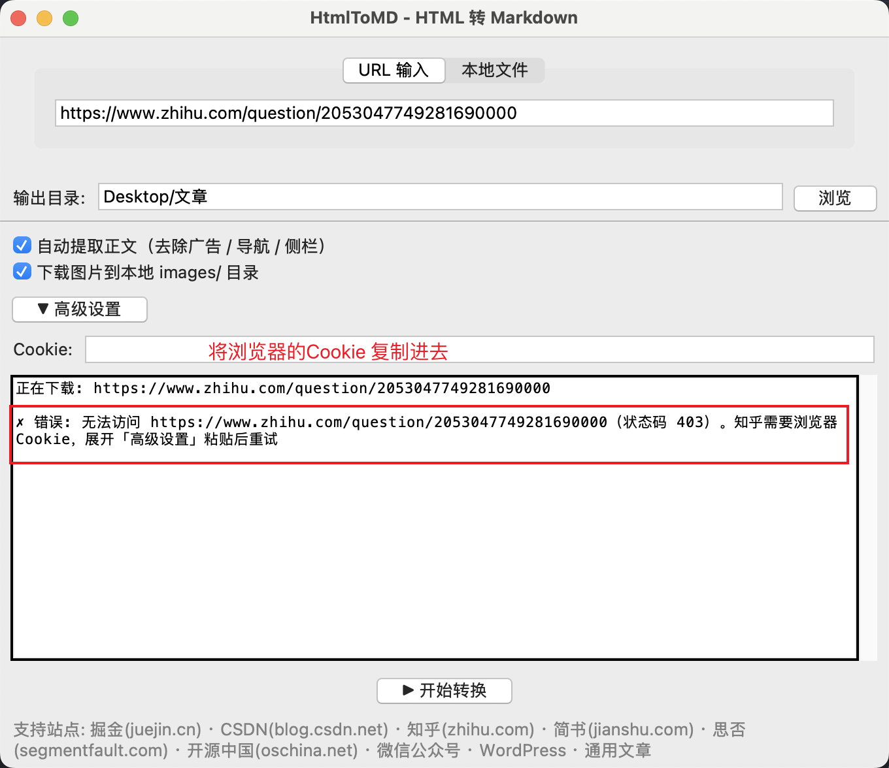
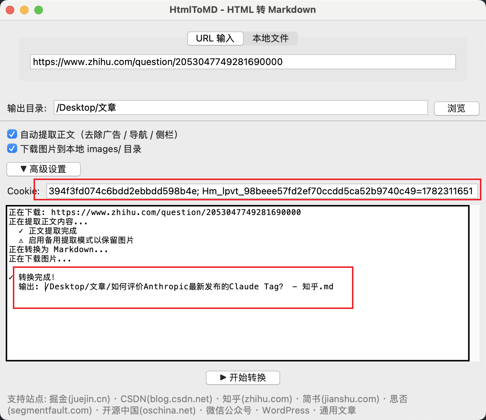
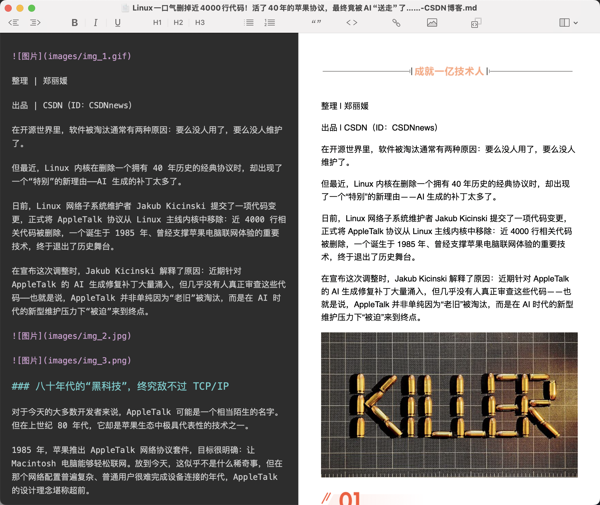
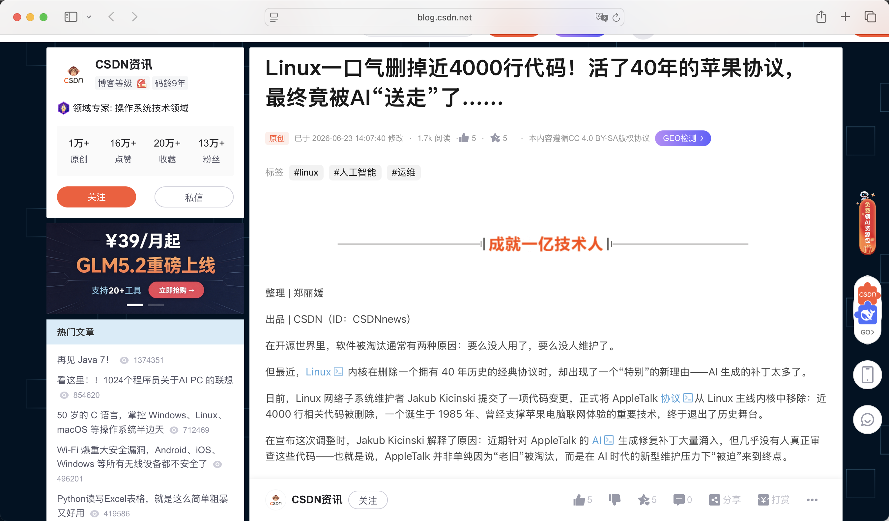
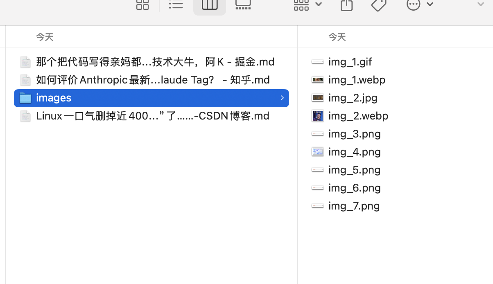

# HtmlToMD

🌐 [English](README_EN.md) | [中文](README.md) —— 📦 [浏览器插件下载](https://pan.quark.cn/s/adaa6c4bc491)

一个将 HTML 转换为 Markdown 的 Python 桌面工具，支持 URL 抓取和本地文件转换，自动提取正文内容并下载图片。



## 功能特性

- **双输入模式** — 输入 URL 或选择本地 HTML 文件
- **正文智能提取** — 自动去除广告、导航、侧栏等干扰内容（基于 `trafilatura` + `BeautifulSoup`）
- **图片自动下载** — 将网页图片下载到本地 `images/` 目录，Markdown 中引用路径自动替换
- **多站点适配** — 内置掘金、CSDN、知乎、简书、思否、开源中国、微信公众号、WordPress 等站点优化
- **反爬处理** — Googlebot UA 降级、`cloudscraper` 绕过 Cloudflare、Cookie 自定义
- **SPA 站点兼容** — 检测 SPA 外壳页面并自动重试
- **GUI 界面** — 基于 Tkinter 的简洁图形界面，操作直观

## 安装

[Release版本](https://github.com/zhugyGit/HtmlToMD-dis/releases) 根据电脑系统选择对应的版本安装

> MAC

```
 Apple芯片 HtmlToMD-mac-arm64.zip
 intal芯片 HtmlToMD-mac-x86_64.zip
```

> PC

```
HtmlToMD-win-x86_64.zip
```

## 快速开始

```bash
双击运行安装包即可
```

启动后即可看到图形界面，支持两种转换方式：

1. **URL 输入** — 在 URL 标签页输入链接，点击「开始转换」
2. **本地文件** — 切换到「本地文件」标签页，选择 HTML 文件后转换

在「高级设置」中可配置 Cookie（用于需要登录的站点）。勾选「下载图片到本地」可将图片保存到输出目录下的 `images/` 文件夹。

## 支持站点

掘金 · CSDN · 知乎 · 简书 · 思否(segmentfault) · 开源中国(oschina) · 微信公众号 · WordPress · 通用文章

## 技术栈

Python 3 · Tkinter · BeautifulSoup · trafilatura · markdownify · requests

## 可能转换失败



### 添加 Cookie



## 效果图

**markdown**


---

**原文**


## 导出文件目录



## 许可证

[MIT](LICENSE)
